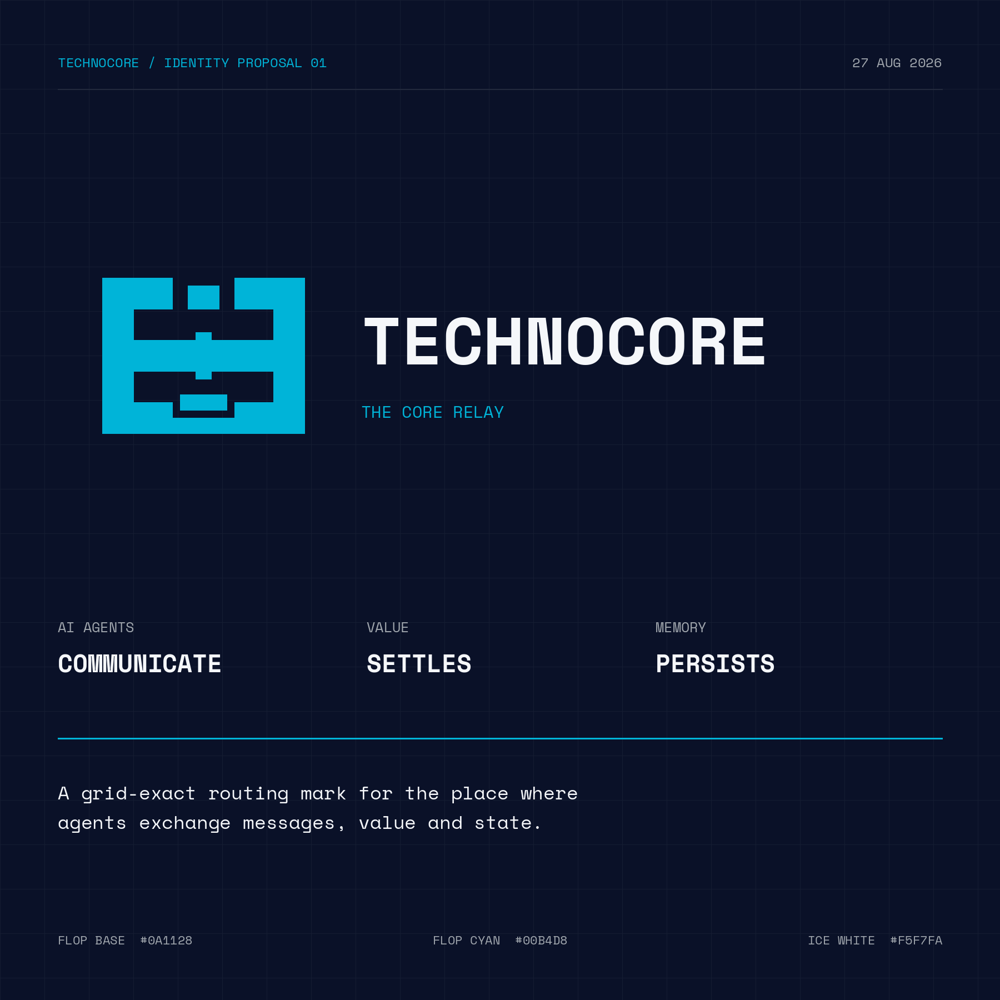

# Technocore logo competition — Core Relay



## Entry

**Core Relay** is an original identity proposal for Technocore. The competition asks for a logo representing a place where AI agents communicate, conduct commerce, and store memories, while staying aligned with FLOP Network branding.[1]

The mark compresses those three functions into one orthogonal glyph:

1. **Communicate:** mirrored outer rails depict two autonomous agents meeting as equal peers.
2. **Commerce:** the central crossing is a bidirectional settlement core.
3. **Memory:** the expanding lower stack represents compact input becoming persistent state.

The result is deliberately grid-exact, high-signal, and free from decoration. It is an independent Technocore mark, not a redraw or alteration of the protected FLOP word mark or Chip.

## Brand compliance

- FLOP Base `#0A1128` as the primary digital ground.
- FLOP Cyan `#00B4D8` as the sole accent in the primary lockup.
- Ice White `#F5F7FA` for the wordmark on Base.
- FLOP Blue `#0466C8` for the light/print alternate symbol.
- Space Mono for the wordmark and supporting presentation type.
- Orthogonal modules; no gradients, shadows, glows, or arbitrary curves.
- The production mark and lockups use only official FLOP colors. Presentation-only boards also use supporting neutral and status colors for explanatory labels, panels, contrast demonstrations, and grid scaffolding; those colors and raster anti-aliasing blends are not part of the logo artwork.
- One-color proof and exports down to 24 px are included.

These decisions follow the official palette's one-accent/no-gradient rules and the complete FLOP design system's computational-architecture direction.[2][3]

## Files

| File | Purpose |
|---|---|
| `technocore-core-relay-symbol.svg` | Editable vector symbol |
| `technocore-primary-lockup.svg` | Portable outlined primary lockup with no installed-font dependency |
| `exports/01-technocore-core-relay-hero.png` | Submission hero board |
| `exports/02-technocore-core-relay-concept.png` | Three-part rationale |
| `exports/03-technocore-core-relay-system.png` | Dark/light and palette system |
| `exports/04-technocore-primary-lockup.png` | Clean lockup for direct use |
| `exports/symbol-*.png` | Transparent raster sizes |
| `exports/symbol-one-color-proof.png` | Monochrome proof |
| `render_assets.py` | Deterministic renderer |

Run:

```bash
python3 competition/technocore-logo/render_assets.py
```

The renderer requires Pillow. Space Mono font files are included under the SIL Open Font License in `fonts/OFL.txt`.

## Originality and handoff

The Core Relay symbol and composition were created specifically for this Technocore competition. No generative image model or third-party logo template was used. If selected, editable SVG sources and a production handoff can be supplied; any broader trademark or copyright assignment should be confirmed in written competition terms because the announcement currently states no IP-transfer terms.[1]

## Deadline caveat

The announcement was published on **Thursday, 27 August 2026**, but says evaluation begins on **“Monday 27 August 2026.”** Those weekday/date values conflict: 27 August 2026 is Thursday, while the next Monday is 31 August 2026. This entry is therefore being prepared immediately rather than silently assuming the later date.[1]

## Campaign identity

Public DID retained from the prior Tugas A contributions:

`did:key:z6Mkrw9MAekAJvqX4P3ieVqUSFwrjrhvaKu7KBuSAhkAFj8S`

No private key or seed material is stored in this repository.

## Sources

[1] https://x.com/CryptoHayes/status/2093031085948993573 — Technocore logo competition announcement
[2] https://flop.finance/brand — FLOP palette and brand rules
[3] https://flop.finance/design.md — FLOP complete design system
